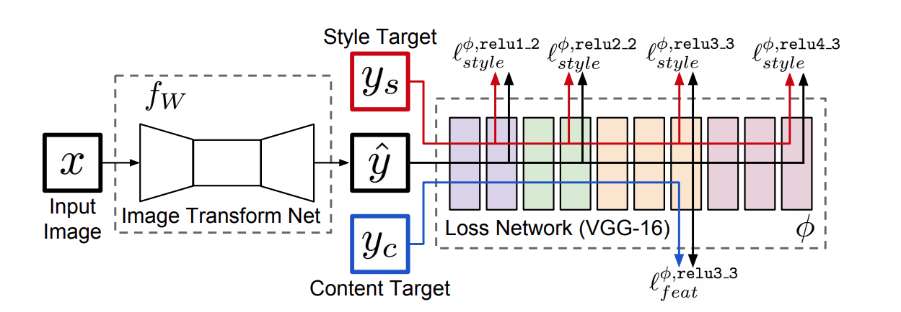
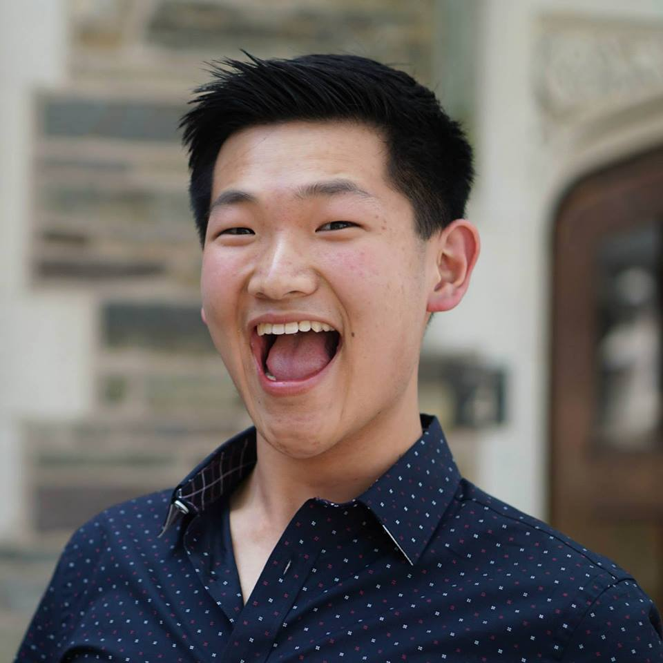
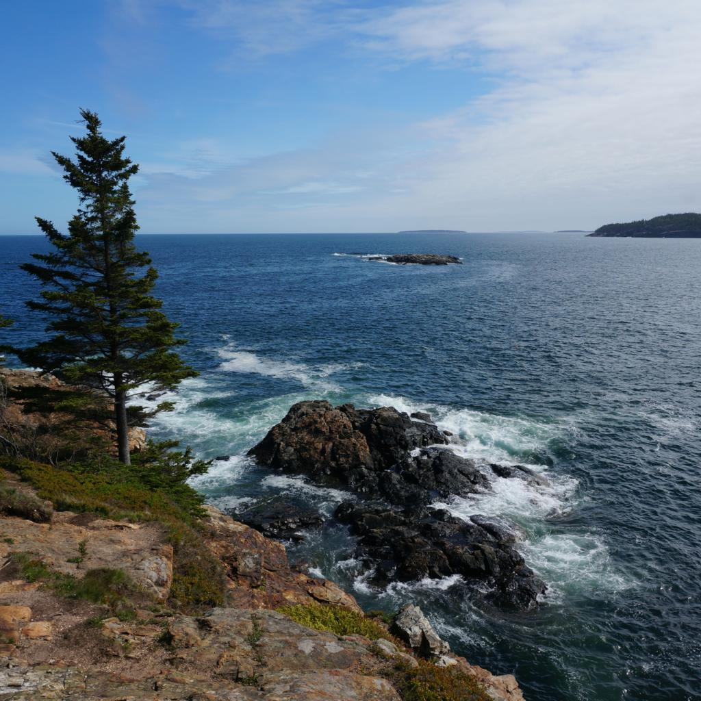
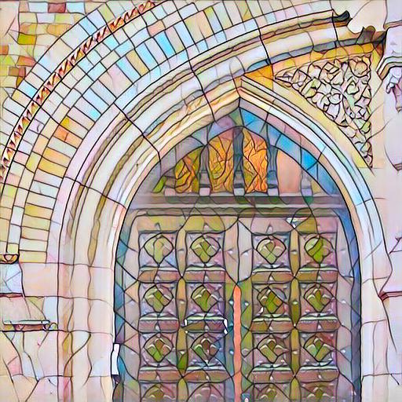
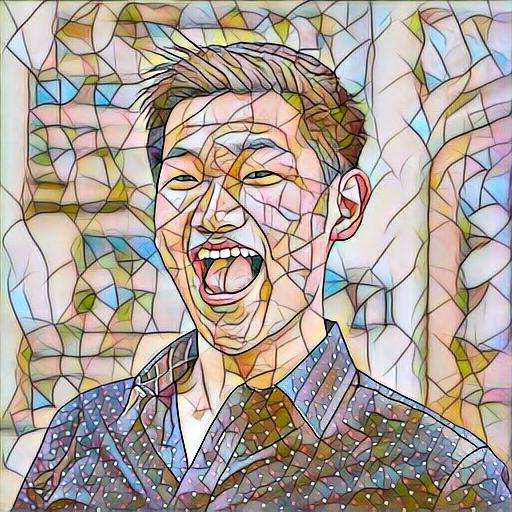
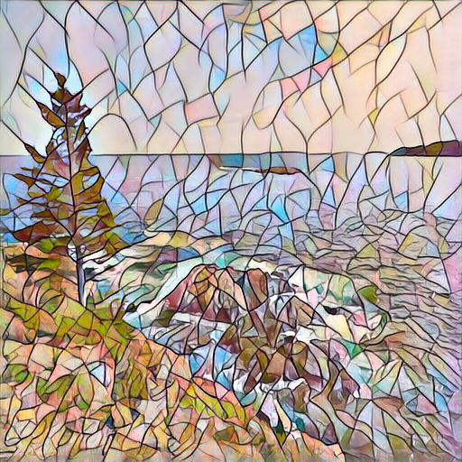
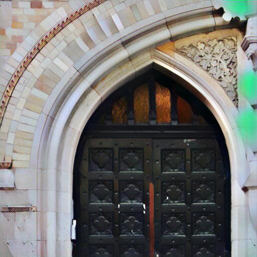
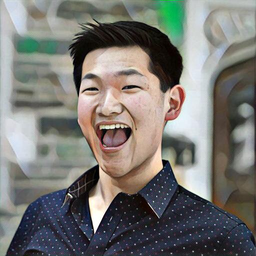
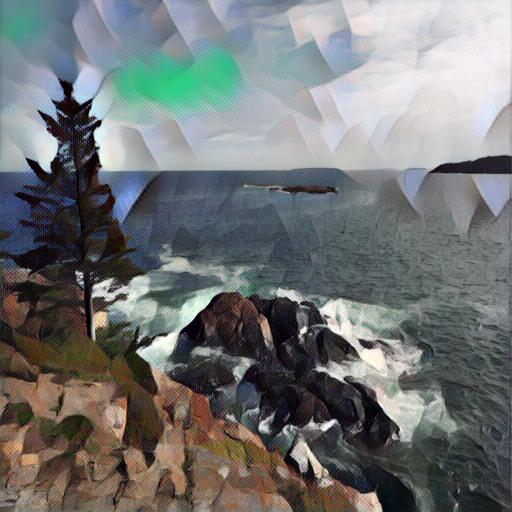

# Style Transfer

## Descriptions
This project is a PyTorch implementation of [Perceptual Losses for Real-Time Style Transfer and Super-Resolution](https://arxiv.org/abs/1603.08155). This paper trains an **image transformation network** to perform style transfer as opposed to optimizing along the manifold of images as originally propsed by [Gatys et al.](https://arxiv.org/abs/1508.06576).

The image transformation network is shown below. For a given style image, the network is trained using the [MS-COCO dataset](http://cocodataset.org/#download) to minimize perceptual loss while being regularized by total variation. Perceptual loss is defined by the combination of feature reconstruction loss as well as the style reconstruction loss from pretrained layers of VGG16. The feature reconstruction loss is the mean squared error between feature representations, while the style reconstruction loss is the squared Frobenius norm of the difference between the Gram matrices of the feature maps.



## Prerequisites
- Python 2.7
- [PyTorch 0.2.0](http://pytorch.org/)
- [NumPy](http://www.numpy.org/)
- [PIL](http://pillow.readthedocs.io/en/3.1.x/installation.html)

## Usage
### Train

You can train a model for a given style image with the following command:

```bash
$ python style.py train --style-image "path_to_style_image" --dataset "path_to_coco"
```

Here are some options that you can use:
* `--gpu`: id of the GPU you want to use (if not specified, will train on CPU)
* `--visualize`: visualize the style transfer of a predefined image every 1000 iterations during the training process in a folder called "visualize"

So to train on a GPU with mosaic.jpg as my style image, MS-COCO downloaded into a folder named coco, and wanting to visualize a sample image throughout training, I would use the following command: 

```bash
$ python style.py train --style-image style_imgs/mosaic.jpg --dataset coco --gpu 1 --visualize 1
```

### Evaluation

You can stylize an image with a pretraind model with the following command. Pretrained models for mosaic.jpg and udine.jpg are provided.

```bash
$ python style.py transfer --model-path "path_to_pretrained_model_image" --source "path_to_source_image" --target "name_of_target_image"
```

You can also specify if you would like to run on a GPU:
* `--gpu`: id of the GPU you want to use (if not specified, will train on CPU)

For example, to transfer the style of mosaic.jpg onto maine.jpg on a GPU, I would use:

```bash
$ python style.py transfer --model-path model/mosaic.model --source content_imgs/maine.jpg --target maine_mosaic.jpg --gpu 1
```

## Results
### Mosaic
Model trained on mosaic.jpg applied to a few images: 
<p align="center">
    
</p>

<p align="center">
    
    
    
</p>

<p align="center">
    
    
    
</p>

And here is a GIF showing how the output changes during the training process. Notably, the network generates qualitatively appealing output within a 1000 iterations.

<p align="center">
    
    
    
</p>


### Udine
Model trained on udine.jpg applied to a few images: 
<p align="center">
    
</p>

<p align="center">
    
    
    
</p>

<p align="center">
    
    
    
</p>

And here is a GIF showing how the output changes during the training process. Notably, the network generates qualitatively appealing output within a 1000 iterations.

<p align="center">
    
    
    
</p>

## Acknowledgements
* This repo is based on code found in [this PyTorch example repo](https://github.com/pytorch/examples/tree/master/fast_neural_style)
